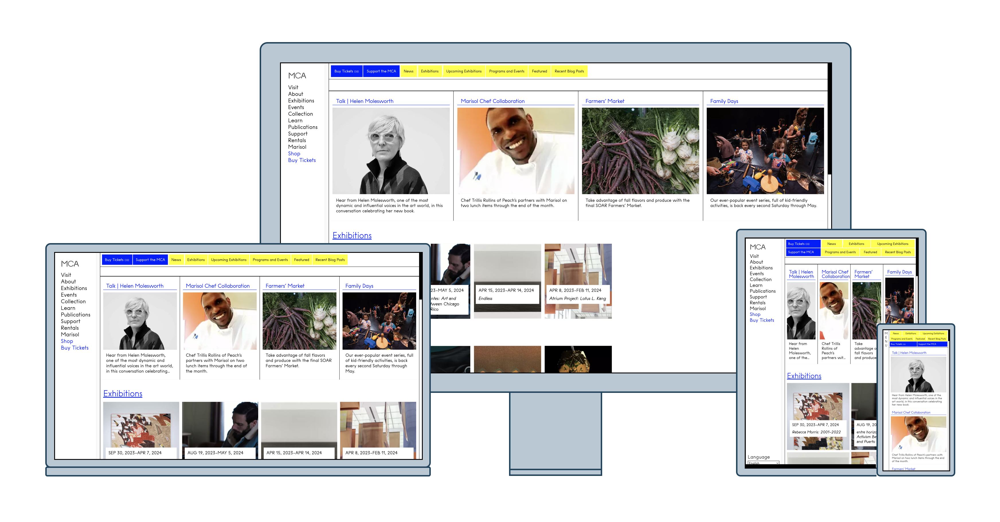
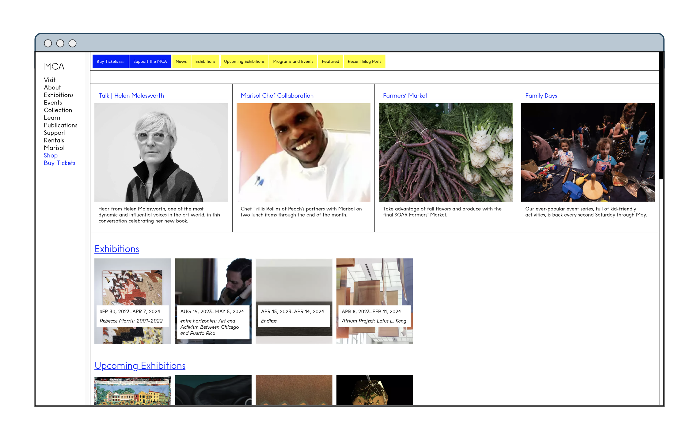

# Portfoliofy!
_Assemble screenshots of web projects for your portfolio_

### Video Demo: [removed]

# Description:

Once a web project is done and handed off, it's time to document the hard work you've done and show them off. _Portfoliofy!_ makes that process easier by doing all the screenshots for you and then assembling them together into portfolio-ready images.

Two PNG files are generated when a valid and accessible URL are given:

* A full desktop browser screenshot (2048x1152)
* A collage of screenshots for various devices: desktop (1920x1080), laptop (1280x720), tablet (600x800), mobile (230x490).

<picture></picture>

More screenshots below.

# Getting Started

### Dependencies

* Pillow==10.1.0
* Requests==2.31.0
* selenium==4.15.0

### Usage

Clone it!
```
$ git clone <url>
```

Go into the project directory and run the command:
```
$ python project.py
```

Enter a valid and accessible URL.

### File Structure

Portfoliofy! closely follows the file structure described in the project brief.

* `project.py`
  * Per the project brief, the `main` function resides in this `.py` file. It coordinates the creation of the final output files, for instance, calling out functions to request and validate a URL from a user, take screenshots, resize those screenshots and assemble the manipulated screenshots into a final product.
* `test_project.py`
  * Per the project brief, the test functions reside here. There are 3. One validates whether a screenshot of a certain dimension has been taken. Another checks if the function that resizes screenshots works as intended. And the last checks if a resized screenshot is placed properly on top of a base image, that is, inside a designated area without spilling beyond a marked boundary. That is done by matching the colors of several pixels from an output image with the expected colors.
* `output` directory
  * This is where a user will find the output images in a directory named `[datetime]_screenshots`. A new directory is created for every run of the program.
  * This is also where the files generated by the test functions are stored in a directory named `[datetime]_test#` when `test_project.py` is executed.
* `images` directory
  * A noncritical directory, it stores the screenshots for this `README.md file`.
* `requirements.txt`
  * This lists the `pip`-installed libraries required for the project.

# Future Work

As a way to outlive the CS50P course, Portfoliofy! will be extended to give users more outputs (e.g., full-page screenshots; animating those full-page screenshots to mimic scrolling a browser; larger versions of screenshots of all devices) and more options (e.g., keep the screenshots rather than the program deleting them; get only one or two or all of the outputs). A more user-friendly interface such as a Flask web app is also planned, thereby extending skills acquired from another CS50 course, CS50x.

## Screenshots

<picture></picture>