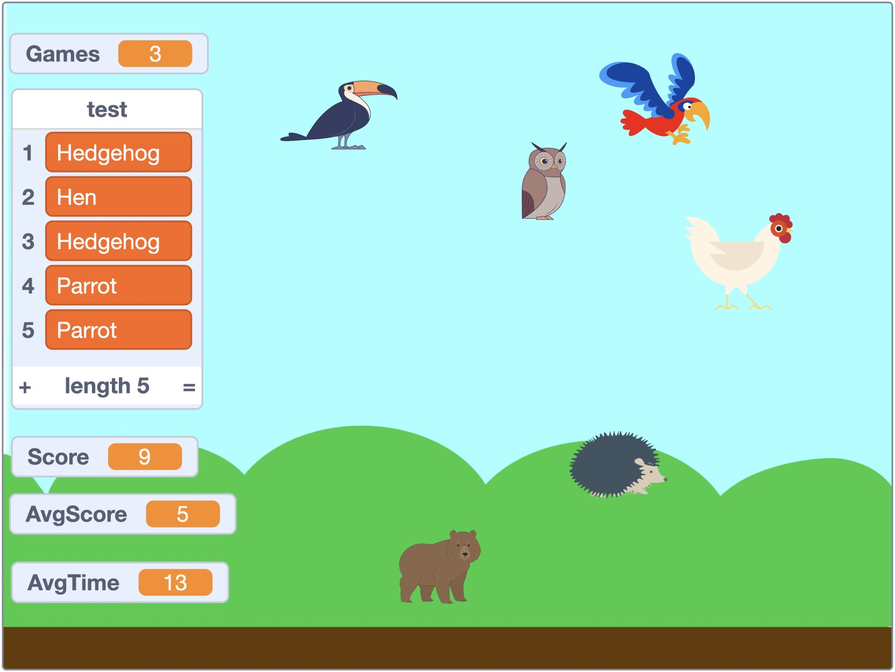

# CS50

An archive of work for CS50x, CS50P and CS50SQL

## Table of Contents

> [!NOTE]
> ALL CONTENTS IN THIS REPO ARE FOR EDUCATIONAL PURPOSES ONLY.

* [Description](#description)
* [Target Users](#target-users)
* [Features](#features)
* [Project Structure](#project-structure)
* [Quick Start](#quick-start)
* [Local Setup](#local-setup)
  * [Prerequisites](#prerequisites)
  * [Dependencies](#dependencies)
  * [Installation](#installation)
  * [Configuration](#configuration)
* [Usage](#usage)
* [Production Setup](#production-setup)
* [System Administration](#system-administration)
* [Author(s)](#authors)
* [Version History](#version-history)
  * [Release Notes](#release-notes)
  * [Initial Release](#initial-release)
* [Future Work](#future-work)
* [License](#license)
* [Contributing](#contributing)
* [Acknowledgments](#acknowledgments)
* [Screenshots](#screenshots)

## Description

_CS50_ is an archive of final projects submitted for several variants of [CS50](https://en.wikipedia.org/wiki/CS50).

Taking to heart the CS50 team's call to `Strive to create something that outlives th[e] course`, these v1.0.0 versions have undergone continuous improvements and feature additions since their submission.

| Course                                           | Title                                             | v1.0.0                                | Post v1.0.0                                                       |
| ------------------------------------------------ | ------------------------------------------------- | ------------------------------------- | ----------------------------------------------------------------- |
| [CS50x](https://cs50.harvard.edu/x/2023/)        | Introduction to Computer Science (v2023)          | [Geo50x](CS50/CS50x)                  | [Geofinder](https://github.com/ggeerraarrdd/geofinder)            |
| [CS50P](https://cs50.harvard.edu/python/2022/)   | Introduction to Programming with Python (v2022)   | [Portfoliofy!](CS50/CS50P)            | [Portfoliofy! API](https://github.com/ggeerraarrdd/portfoliofy)   |
| [CS50SQL](https://cs50.harvard.edu/sql/2023/)    | Introduction to Databases with SQL (v2023)        | [Public Art Database](CS50/CS50SQL)   | [Public Art API](https://github.com/ggeerraarrdd/public-art)      |

In accordance with CS50's [Academic Honesty](https://cs50.harvard.edu/x/2023/honesty/) policy, solutions to Problem Sets (psets) are not archived here and are housed instead in a separate, private [repository](https://github.com/ggeerraarrdd/cs50-psets):lock:. However, they can be shared upon requests by non-"future students", such as recruiters and hiring managers.

For portfolio purposes, pset8 of CS50x: `Homepage` is an exception. Check it out on its own repo at [Large Parks](https://github.com/ggeerraarrdd/large-parks).

These projects are shared in the spirit of self-learning, and hope they become valuable resources in your own educational journey.

_(The Bear, The Chicken, Hedgehog, The Hen, The Parrot and The Toucan: The Game)_

## Target Users

_CS50_ is intended for:

* **CS50 course students** seeking examples of final projects for inspiration.
* **Self-guided learners** interested in seeing the evolution of projects from academic submissions to more refined applications.
* **Potential employers or recruiters** reviewing portfolio work.

## Features

* 📚 **Learning Resource** - Archive of final projects from multiple CS50 course variants (CS50x, CS50P, CS50SQL)

## Project Structure

* NA

## Quick Start

* Read-only recommended for [v1.0.0 versions](CS50/). See quickstart details in each project's post-v1.0.0 repository.

## Local Setup

### Prerequisites

* Read-only recommended for [v1.0.0 versions](CS50/). See prerequisites details in each project's post-v1.0.0 repository.

### Dependencies

* Read-only recommended for [v1.0.0 versions](CS50/). See dependency details in each project's post-v1.0.0 repository.

### Installation

* Read-only recommended for [v1.0.0 versions](CS50/). See installation details in each project's post-v1.0.0 repository.

### Configuration

* Read-only recommended for [v1.0.0 versions](CS50/). See configuration details in each project's post-v1.0.0 repository.

## Usage

* Read-only recommended for [v1.0.0 versions](CS50/). See usage details in each project's post-v1.0.0 repository.

## Production Setup

* Read-only recommended for [v1.0.0 versions](CS50/). See production setup details in each project's post-v1.0.0 repository.

## System Administration

* Read-only recommended for [v1.0.0 versions](CS50/). See system administration details in each project's post-v1.0.0 repository.

## Author(s)

* [@ggeerraarrdd](https://github.com/ggeerraarrdd/)

## Version History

### Release Notes

* See [https://github.com/ggeerraarrdd/cs50/releases](https://github.com/ggeerraarrdd/cs50/releases)

### Initial Release

* NA

## Future Work

* TBD

## License

* [MIT License](https://github.com/ggeerraarrdd/cs50/blob/main/LICENSE)

## Contributing

* NA

## Acknowledgments

* The CS50 team for their intellectually-stimulating courses.

## Screenshots

## Frontispiece

* Screenshot of _The Bear, The Chicken, Hedgehog, The Hen, The Parrot and The Toucan: The Game_, a Scratch project. Personal collection, 2023. In the public domain.
